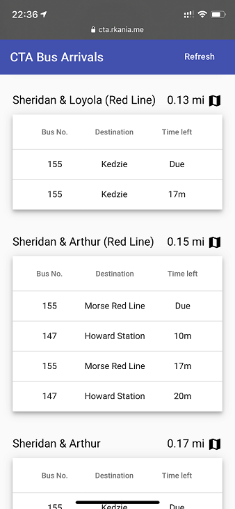

# GoCtaApi
Go microservice wrapping Chicago's CTA API

Live demo: https://cta.rkania.me  
UI source: https://github.com/RobusK/AngularCtaUi

## FAQ  
- Why would you build another CTA tracker?
  - I wanted a quick way to see whether a scheduled bus is about to leave, without having to type in where I'm going in Google Maps/etc.
- Why only bus stations?
  - The train API is separate from the bus API, and the trains generally run often enough that you'd only have to wait a couple minutes for the next one. I do plan on adding the functionality though.
  
  
## Todo
- Use dataloader to cache requests
- Add trains
- Consider a native app for iOS/Android